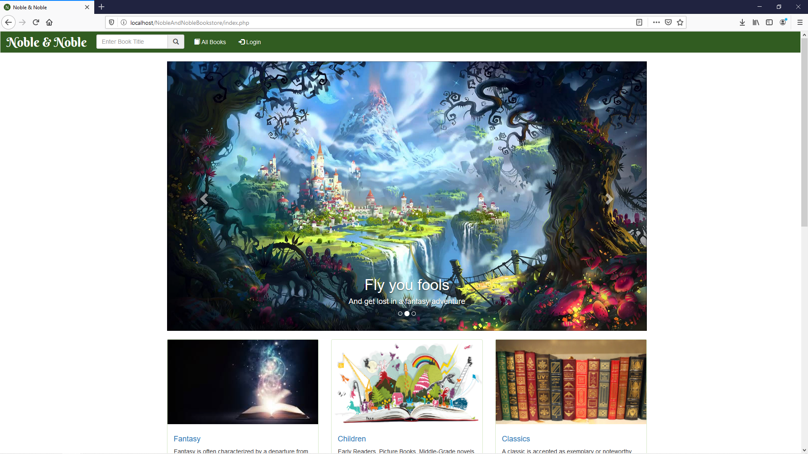
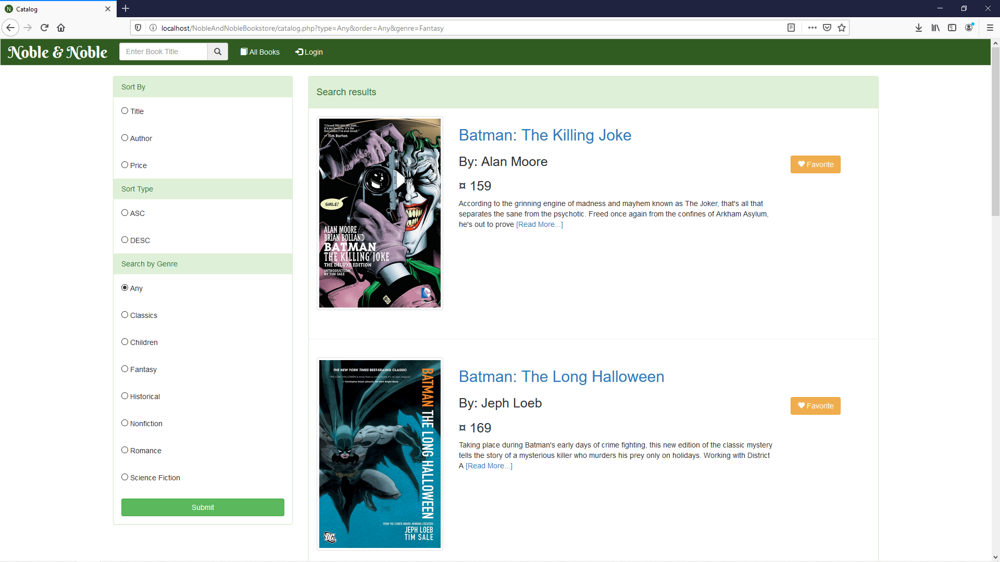
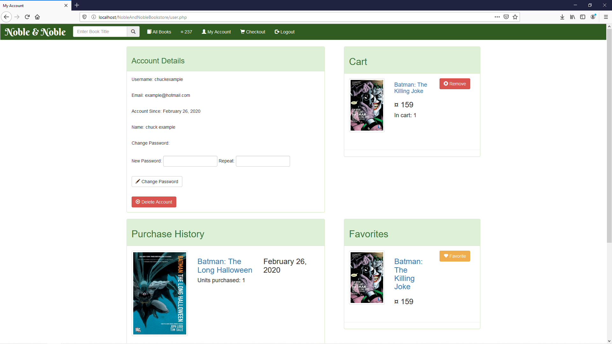

# NobleAndNobleBookstore
A online bookstore created as a final for my web design class in April 2018. I worked on this project solo, hence the name "Noble&Noble"! Note that this is in no means a representation of good modern web site design and server programming, especially some of the security practices (*ahem leaving db_config.php in a public repository*). This mostly serves as a time capsule for me to look back to in the future :)

### Homepage

### Catalog/Search

### Product Page
")

### Product Page

#### ToDo:
+ Add installation instructions
